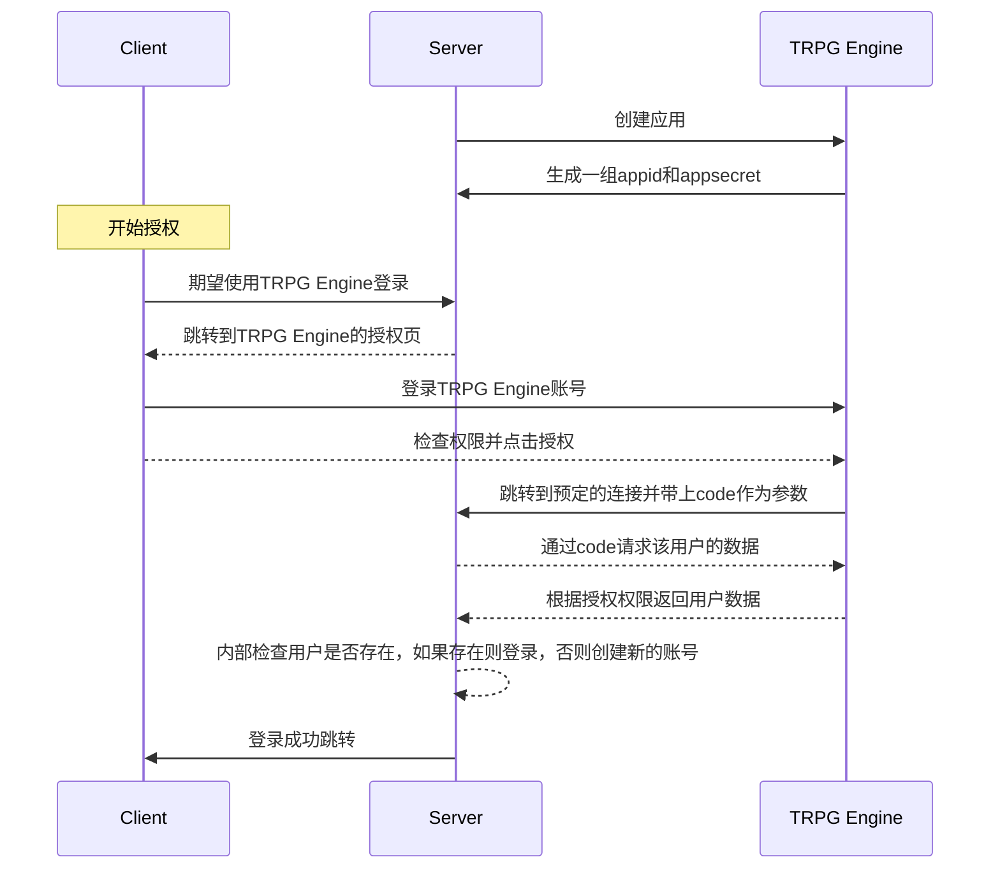

`TRPG Engine` 提供`OAuth`服务, 基于`OAuth 2.0`协议实现.

## 准备工作

### 什么是 OAuth

[https://en.wikipedia.org/wiki/OAuth](https://en.wikipedia.org/wiki/OAuth)

### 创建应用

[创建应用](./create)

## 架构

```mermaid
sequenceDiagram
  participant C as Client
  participant S as Server
  participant T as TRPG Engine
  
  S ->> T: 创建应用
  T ->> S: 生成一组appid和appsecret
  
  Note over C: 开始授权
  
  C ->> S: 期望使用TRPG Engine登录
  S -->> C: 跳转到TRPG Engine的授权页
  C ->> T: 登录TRPG Engine账号
  C -->> T: 检查权限并点击授权
  T ->> S: 跳转到预定的连接并带上code作为参数
  S -->> T: 通过code请求该用户的数据
  T -->> S: 根据授权权限返回用户数据
  S -->> S: 内部检查用户是否存在，如果存在则登录，否则创建新的账号
  S ->> C: 登录成功跳转
```
