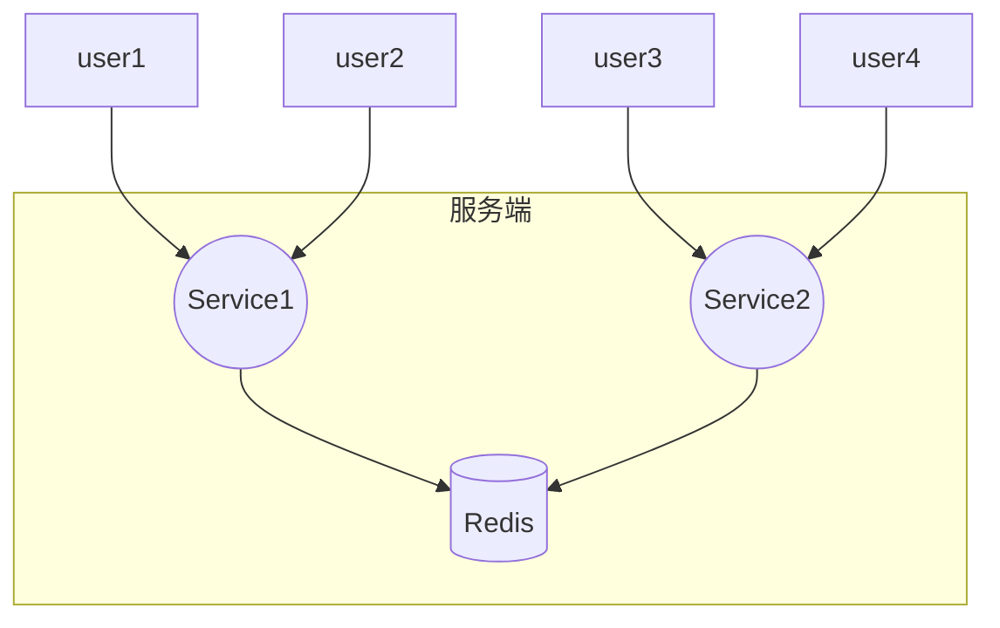
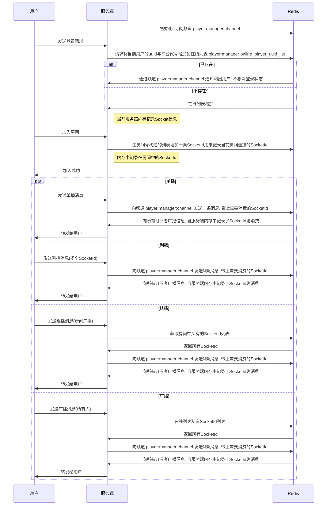

`PlayerManager` 多实例 Socket 通讯架构:

```mermaid
flowchart TD
  redis[(Redis)]
  service1((Service1))
  service2((Service2))

  user1 --> service1
  user2 --> service1
  user3 --> service2
  user4 --> service2
  subgraph 服务端
    service1 --> redis
    service2 --> redis
  end
```

时序图:

```mermaid
sequenceDiagram
  participant 用户
  participant 服务端
  participant Redis

  服务端->>Redis: 初始化, 订阅频道 player:manager:channel

  用户->>服务端: 发送登录请求
  服务端->>Redis: 请求将当前用户的uuid与平台代号增加到在线列表 player:manager:online_player_uuid_list
  alt 已存在:
    Redis->>服务端: 通过频道 player:manager:channel 通知踢出用户, 不移除登录状态
  else 不存在:
    Redis->>服务端: 在线列表增加
  end
  Note right of 服务端: 当前服务器内存记录Socket信息

  用户->>服务端: 加入房间
  服务端->>Redis: 由房间号构造的列表增加一条SocketId用来记录当前房间连接的SocketId
  Note right of 服务端: 内存中记录在房间中的SocketId
  服务端->>用户: 加入成功

  par 单播
    用户->>服务端: 发送单播消息
    服务端->>Redis: 向频道 player:manager:channel 发送一条消息, 带上需要消费的SocketId
    Redis->>服务端: 向所有订阅者广播信息, 当服务端内存中记录了SocketId则消费
    服务端->>用户: 转发给用户
  and 列播
    用户->>服务端: 发送列播消息(多个SocketId)
    服务端->>Redis: 向频道 player:manager:channel 发送N条消息, 带上需要消费的SocketId
    Redis->>服务端: 向所有订阅者广播信息, 当服务端内存中记录了SocketId则消费
    服务端->>用户: 转发给用户
  and 组播
    用户->>服务端: 发送组播消息(房间广播)
    服务端->>Redis: 获取房间中所有的SocketId列表
    Redis->>服务端: 返回所有SocketId
    服务端->>Redis: 向频道 player:manager:channel 发送N条消息, 带上需要消费的SocketId
    Redis->>服务端: 向所有订阅者广播信息, 当服务端内存中记录了SocketId则消费
    服务端->>用户: 转发给用户
  and 广播
    用户->>服务端: 发送广播消息(所有人)
    服务端->>Redis: 在线列表所有SocketId列表
    Redis->>服务端: 返回所有SocketId
    服务端->>Redis: 向频道 player:manager:channel 发送N条消息, 带上需要消费的SocketId
    Redis->>服务端: 向所有订阅者广播信息, 当服务端内存中记录了SocketId则消费
    服务端->>用户: 转发给用户
  end
```
