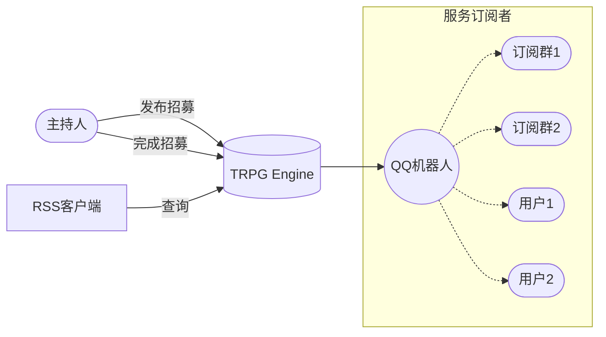

**自由招募**是一个独立于`TRPG Engine`的跑团招募功能。本功能目的是打通多个渠道，让玩家能够更好更方便的将需求的招募请求以 TRPG Engine 为中心分发到各个渠道。

网址: [https://trpg.moonrailgun.com/portal/trpg/recruit/list](https://trpg.moonrailgun.com/portal/trpg/recruit/list)

作为主持人: 你可以在`TRPG Engine`的**自由招募**中发布你的开团申请。

作为玩家: 你可以用任意的 RSS 软件，或者 QQ 机器人，来获取最新的招募列表，从而找到你喜欢的团

RSS 订阅地址: `https://trpgapi.moonrailgun.com/trpg/recruit/feed`

## Why

自由招募主要解决的是目前跑团找团难，招人难的问题。

总所周知目前跑团招人的渠道有以下:

- 果园挂招募帖
- 帖吧长期招募
- QQ 群挂公告

虽然渠道很多但是招人的效率却很低。没有办法做到一次发帖能覆盖到足够的人群。作为主持人，必须添加多个大群，并请求管理员帮忙挂招人帖。作为玩家，也必须时不时查看群公告来获取最新动态。

其问题在于，每个大群都相当于一个个信息孤岛，而`TRPG Engine`想要做的，就是打破这些信息孤岛。只要一次发布，就可以推广到足够的人群。

---

其他内容:

- [关于 RSS](https://baike.baidu.com/item/rss/24470)
